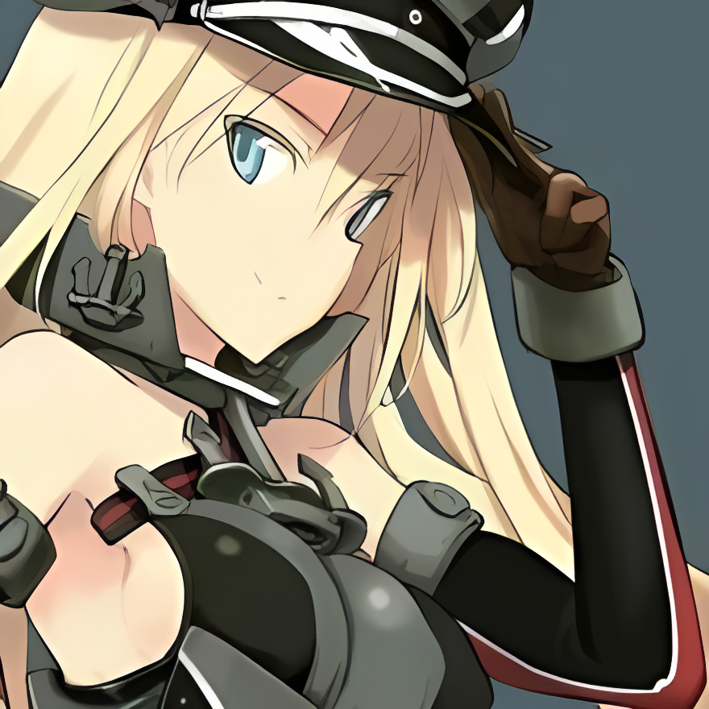
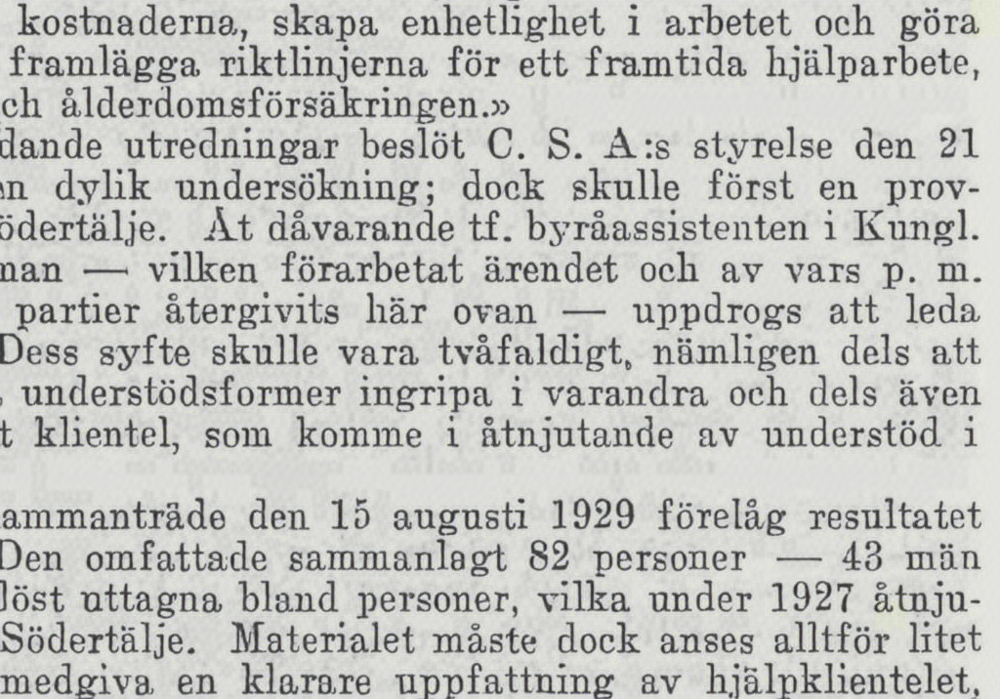
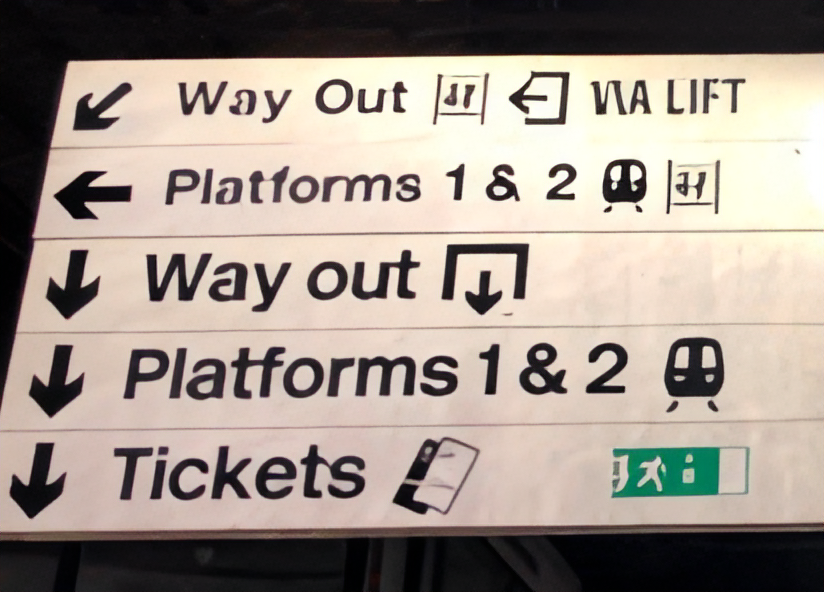
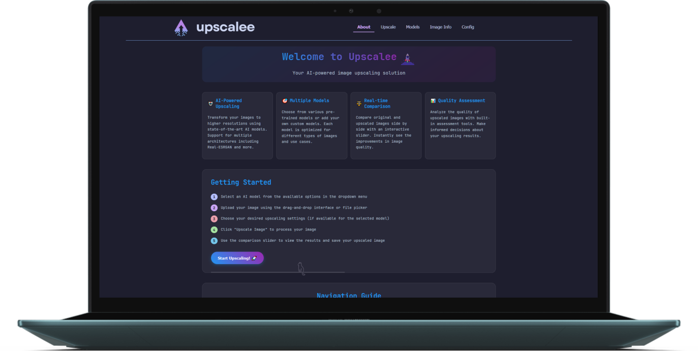

<div align="center">
  
  

# 

### An AI-powered image upscaling application with real-time quality assessment
  
  
  
  

  [View Demo](https://drive.google.com/file/d/1PzRON9xGYR936UD0QqtBk7SQOIciFbPg/view?usp=sharing) · [Report Bug](https://github.com/DieterR97/Upscalee/issues) · [Request Feature](https://github.com/DieterR97/Upscalee/issues)

  # 

</div>

# Upscalee

## Quick Navigation
<div align="center">
  <h3 style="display: inline;"><a href="#-ai-powered-upscaling">🤖 AI Upscaling</a></h3>
  &nbsp;&nbsp;&nbsp;&nbsp;&nbsp;&nbsp;
  <a href="#comparison-examples">
    <br />⚖️ <h3 style="display: inline;">Comparison</h3>
  </a>&nbsp;&nbsp;&nbsp;&nbsp;&nbsp;&nbsp;
  <a href="#-image-quality-assessment-iqa">
    <br />📊 <h3 style="display: inline;">Quality Assessment</h3>
  </a>&nbsp;&nbsp;&nbsp;&nbsp;&nbsp;&nbsp;
  <a href="#%EF%B8%8F-advanced-configuration">
    <br />⚙️ <h3 style="display: inline;">Configuration</h3>
  </a>
</div>

## Table of Contents
* [About the Project](#about-the-project)
  * [Project Description](#project-description)
  * [Built With](#built-with)
* [Getting Started](#getting-started)
  * [Prerequisites](#prerequisites)
  * [Installation](#installation)
* [Features and Functionality](#features-and-functionality)
  * [AI-Powered Upscaling](#-ai-powered-upscaling)
  * [Real-time Comparison](#-real-time-comparison)
  * [Quality Assessment](#-quality-assessment)
  * [Advanced Configuration](#-advanced-configuration)
* [Concept Process](#concept-process)
  * [Ideation](#ideation)
    * [Initial Research & Problem Identification](#initial-research--problem-identification)
    * [Key Design Goals](#key-design-goals)
    * [Design Evolution](#design-evolution)
    * [Target Audience](#target-audience)
  * [User-flow](#user-flow)
* [Development Process](#development-process)
  * [Implementation Process](#implementation-process)
  * [Reviews & Testing](#reviews--testing)
  * [Future Implementation](#future-implementation)
* [Final Outcome](#final-outcome)
  * [Mockups](#mockups)
  * [Video Demonstration](#video-demonstration)
* [Conclusion](#conclusion)
* [Contributing](#contributing)
* [License](#license)
* [Contact](#contact)
* [Acknowledgements](#acknowledgements)
* [FAQ](#faq)

## About the Project

### Project Description
Upscalee is a powerful image upscaling application that leverages state-of-the-art AI models to enhance image resolution (also called 'Super Resolution') while maintaining and improving image quality. The application features a user-friendly interface with real-time comparison tools and comprehensive image quality assessment capabilities.

<div align="center">
  <!-- Add a screenshot or demo GIF of your application here -->
  
</div>

# 

### Built With
* **Frontend:**
  * [React](https://create-react-app.dev/)
  * [TypeScript](https://www.typescriptlang.org/)
  * [Node.js](https://nodejs.org/en)
  * [Catppuccin](https://catppuccin.com/palette)
* **Backend:**
  * [Python](https://www.python.org/)
  * [Flask](https://flask.palletsprojects.com/) 
  * [PyTorch](https://pytorch.org/)
  * [Pillow](https://pillow.readthedocs.io/en/stable/)
  * [OpenCV](https://opencv.org/)
  * [Real-ESRGAN](https://github.com/xinntao/Real-ESRGAN)
  * [Spandrel](https://github.com/chaiNNer-org/spandrel)
  * [PyIQA](https://github.com/chaofengc/IQA-PyTorch)

## Getting Started

### Prerequisites

#### System Requirements

| Component | Minimum | Recommended |
|-----------|---------|-------------|
| RAM | 8GB | 16GB |
| GPU | None (CPU only) | NVIDIA GPU with 4GB+ VRAM |
| Storage | 4GB free | 8GB+ free |
| CPU | 4 cores | 6+ cores |

#### Software Requirements
- Python 3.10 or higher
- Node.js 16+ and npm
- CUDA Toolkit 11.7+ (for GPU acceleration)
- Git LFS (for downloading model files)

### Installation

1. Clone the repository

```bash
git clone https://github.com/DieterR97/Upscalee.git
cd Upscalee
```
2. Run the setup script

```bash
setup.bat
```
This will:
- Set up the Python virtual environment
- Install all required Python packages
- Install frontend dependencies
- Create necessary directories
- Configure CUDA if available
- Patching necessary package files

3. Start the application

```bash
run.bat
```
Or manually:
- Activate virtual environment: `venv\Scripts\activate`
- Start backend: `cd backend & python app.py`
- Start frontend: `cd frontend/react-app & npm start`

### Installation Troubleshooting

Common issues and solutions:

1. **CUDA Installation Fails**
   - Ensure you have a compatible NVIDIA GPU
   - Try installing CUDA Toolkit manually from NVIDIA website
   - Verify GPU drivers are up to date

2. **Package Installation Errors**
   - You might have to run setup.bat a few times as its process sometimes does stall in the terminal, i.e. you will have to kill the process in the terminal or close the terminal window and run setup.bat again.
   - Try running: `pip install --upgrade pip`
   - Install Visual C++ Build Tools if on Windows
   - Use: `pip install -r requirements.txt --no-cache-dir`

3. **Application Won't Start**
   - Check if ports 3000 and 5000 are available
   - Ensure all prerequisites are installed
   - Check logs in `logs/` directory

## Features and Functionality

### 🤖 AI-Powered Upscaling
* Transform your images to higher resolutions (Super Resolution) using state-of-the-art AI models
* Support for multiple AI model architectures including Real-ESRGAN and much more
* Support for various upscaling factors (1x, 2x, 4x) (Depending on the model used)
* CUDA acceleration for faster processing

<div align="center">
  <h1>Comparison Examples</h1>
  <table>
    <tr>
      <td colspan="2" align="center"><h3>RealESRGAN_x4plus_anime_6B</h3></td>
    </tr>
    <tr>
      <td></td>
      <td></td>
    </tr>
    <tr>
      <td align="center">Before</td>
      <td align="center">After (4x Upscale)</td>
    </tr>
    <tr>
      <td colspan="2" align="center"><h3>4xNomos2_otf_esrgan</h3></td>
    </tr>
    <tr>
      <td></td>
      <td></td>
    </tr>
    <tr>
      <td align="center">Before</td>
      <td align="center">After (4x Upscale)</td>
    </tr>
    <tr>
      <td colspan="2" align="center"><h3>2x_Text2HD_v.1-RealPLKSR</h3></td>
    </tr>
    <tr>
      <td></td>
      <td></td>
    </tr>
    <tr>
      <td align="center">Before</td>
      <td align="center">After (2x Upscale)</td>
    </tr>
    <tr>
      <td colspan="2" align="center"><h3>8x_NMKD-Typescale_175k</h3></td>
    </tr>
    <tr>
      <td></td>
      <td></td>
    </tr>
    <tr>
      <td align="center">Before</td>
      <td align="center">After (8x Upscale)</td>
    </tr>
  </table>
</div>

### ⚖️ Real-time Comparison
* Interactive slider comparison for before/after comparison
* Includes panning, zooming, slider and full screen functionality
* Ability to 'Queue` results to compare model outputs
* Detailed image information and metadata

### 📊 Image Quality Assessment (IQA)
* Comprehensive image quality metrics
* Both reference and no-reference quality assessment
* Real-time quality score calculation

### ⚙️ Advanced Configuration
* Custom model support
* Configurable processing parameters
* (more configurable options coming soon)

## Concept Process

### Ideation

The concept for Upscalee emerged from several key observations and needs in the image processing space:

#### Initial Research & Problem Identification
* Many existing upscaling tools are difficult/complex to use or don't offer the necessary features (comparison, IQA, multi-model support, etc.)
* Professional upscaling software is often expensive and resource-intensive
* Existing cloud based upscaling tools are behind paywalls and often have limited functionality
* Users need real-time (and various/comprehensive) feedback on image quality improvements
* Limited options for comparing different AI model outputs

#### Key Design Goals
* **Simplicity**: Create an intuitive, user-friendly interface that doesn't require technical expertise
* **Transparency**: Provide clear metrics and visual comparisons of results
* **Flexibility**: Support multiple AI models and configuration options
* **Performance**: Optimize for both speed and quality
* **Offline Access**: Allow users to upscale images offline

#### Design Evolution
<!-- <div align="center">
  
</div> -->

1. **Initial Concept**: Simple upscaling tool with basic comparison and basic image information
2. **Iteration 1**: Added multi-model architecture support
2. **Iteration 2**: Added real-time image quality assessment (IQA)
3. **Iteration 3**: Introduced multi-model comparison
4. **Final Design**: Integrated advanced features while maintaining simplicity

#### Target Audience
* Photography enthusiasts
* Digital artists
* Content creators
* Web developers
* Anyone needing high-quality image upscaling

### User-flow

<!-- <div align="center">
  
</div> -->

#### 1. Image Input
* User uploads an image through drag & drop or file selection
* Supported formats: JPG, PNG, WEBP
* System validates image size and format

#### 2. Model Selection
* User selects desired AI upscaling model
* Supports multiple AI model architectures
* Choose upscaling factor (1x, 2x, 4x) (depending on the model used)

#### 3. Processing
* System performs upscaling operation
* GPU/CPU resource allocation

#### 4. Results & Comparison
* View upscaled image result
* Interactive comparison tools:
  * Slider comparison
  * Queue results for different model outputs comparison
* Quality metrics:
  * Various IQA (Image Quality Assessment) metrics to choose from

#### 5. Post-Processing Options
* Save result
* Queue result for multi-model comparison
* Download original and processed images

#### 6. Additional Features
* Full-screen comparison mode
* Image information and metadata viewing
* Detailed quality assessment reports

## Development Process

### Implementation Process
* **Frontend Architecture:**
  * React with TypeScript for type safety
  * Component-based design for modularity

* **Backend Architecture:**
  * Flask REST API
  * PyTorch, Real-ESRGAN & Spandrel for AI model inference
  * Efficient image processing pipeline

#### Highlights
* Successfully implemented Real-ESRGAN model integration
* Created an intuitive comparison interface
* Achieved real-time image quality assessment
* Successfully implemented multi-model architecture support

#### Challenges
* Initial learning curve for model inference
* Integrating smooth image comparison
* Optimizing performance by utilising GPU (CUDA)
* Implementing efficient image processing pipeline

### Reviews & Testing
- Gave users a Google Form to fill in feedback
- You can also provide by filling in the [Google Form Here](https://docs.google.com/forms/d/e/1FAIpQLSeRnh1b1Ao1PxDKM_isHHBxxFwyrUNPUi6LP01HM9fHyt7DGg/viewform?usp=sf_link)
- View [Reviews & Testing Report Here](https://docs.google.com/spreadsheets/d/1lrbd0VWHyAr1QmtIAJurzlhOCdozIPXzV_enouf2T60/edit?usp=sharing)

### Future Implementation
- [ ] Batch processing capabilities
- [ ] Export IQA (Image Quality Assessment) Results
- [x] Export Slider Comparison View (Snapshot)
- [ ] Progress indicator for upscaling process
- [x] Image Comparison: Switch Mode (switch original/upscaled image view full view with mouse click/keyboard arrows)
- [x] Image Comparison: Difference Mode (pixel difference/heatmap of original vs. upscaled result)
- [ ] Advanced image preprocessing options
- [ ] Advanced project configuration options
- [ ] Generate image caption/description using computer vision AI
- [ ] Use image classification AI model (possibly fine-tuned/trained by me) to analyse image and recomend applicable/appropriate upscale model to use

## Final Outcome

### Mockups

# 

</img>

# 

</img>

# 


</img>

# 


</img>

# 


</img>

# 

### Video Demonstration
<!-- Add a link to your demo video if available -->

[View Demonstration](https://drive.google.com/file/d/1PzRON9xGYR936UD0QqtBk7SQOIciFbPg/view?usp=sharing)

## Conclusion
Upscalee represents a significant step forward in making professional-grade image upscaling accessible to everyone. By combining state-of-the-art AI models with an intuitive interface and comprehensive quality assessment tools, I've created a solution that bridges the gap between complex professional software and simple online tools.

Key achievements include:
* Successfully implemented multiple AI model architectures for flexible upscaling options
* Created an intuitive user interface that maintains powerful functionality
* Introduced comprehensive image quality assessment capabilities
* Built a robust comparison system for evaluating different upscaling results

Through user testing and feedback, I've confirmed that Upscalee meets its core objectives of providing a powerful yet accessible image upscaling solution. As I continue to develop and implement new features, I remain committed to my vision of making advanced image processing technology available to everyone.

## Contributing
1. Fork the Project
2. Create your Feature Branch (`git checkout -b feature/AmazingFeature`)
3. Commit your Changes (`git commit -m 'Add some AmazingFeature'`)
4. Push to the Branch (`git push origin feature/AmazingFeature`)
5. Open a Pull Request

## License
Distributed under the MIT License. See `LICENSE` for more information.

## Contact
Dieter Roelofse - [GitHub](https://github.com/DieterR97)

Project Link: [https://github.com/DieterR97/Upscalee](https://github.com/DieterR97/Upscalee)

## Acknowledgements
* [Real-ESRGAN](https://github.com/xinntao/Real-ESRGAN)
* [Spandrel](https://github.com/chaiNNer-org/spandrel)
* [PyIQA](https://github.com/chaofengc/IQA-PyTorch)
* [Catppuccin](https://catppuccin.com/palette)
* [Flask](https://flask.palletsprojects.com/) 
* [PyTorch](https://pytorch.org/)
* [Cursor](https://www.cursor.com/)
* [claude-3.5-sonnet](https://www.anthropic.com/news/claude-3-5-sonnet) - [2](https://www.anthropic.com/claude/sonnet)
* [Cartograph CF](https://fonts.adobe.com/fonts/cartograph-cf)

## FAQ

#### Q: Which model should I use for anime/artwork upscaling?
A: For anime and artwork, we recommend using the Real-ESRGAN-Anime model as it's specifically trained on animated content.

#### Q: Why is the upscaling process slow on my computer?
A: Processing speed depends primarily on your GPU. Using CPU-only mode will be significantly slower. Enable CUDA if you have a compatible NVIDIA GPU. The processing speed also depends on the initial image dimensions of the image you are upscaling.

#### Q: What's the maximum image size supported?
A: The maximum input image size depends on your available GPU memory. As a general guide:
- 4GB VRAM: Up to 2000x2000 pixels
- 8GB VRAM: Up to 4000x4000 pixels
- 16GB VRAM: Up to 8000x8000 pixels
